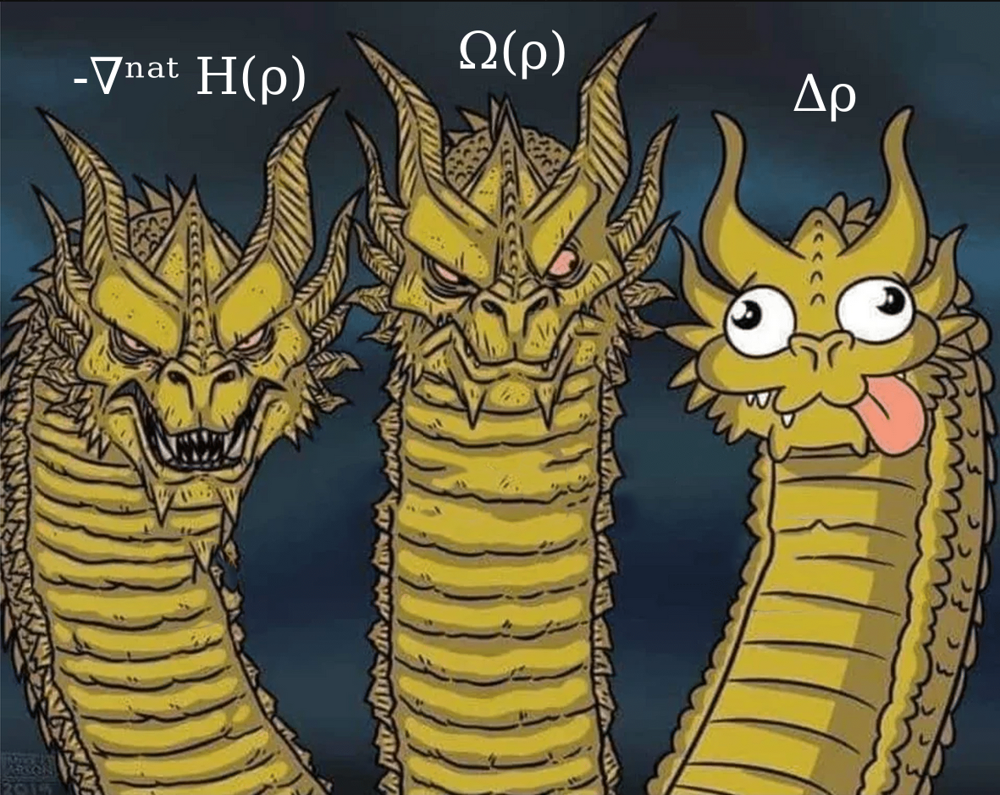

# Hydra - Parameter-Efficient Language Models with Hydrodynamical Latent Semantics

All models are wrong, but some are useful.

Likewise, all language models are (often) wrong, but nevertheless useful.

Hydra is written in Python and tracked by Neptune.ai, requires Multi-Head Attention for good handling, is potentially Basilisk-relevant, and induces a latent semantic flow that approximately obeys an anisotropic Navier-Stokes equation.

Code adapted from the wonderful [nanoGPT](https://github.com/karpathy/nanoGPT).

### Latent evolution

  

There are **interactive** sample visualisations [here](https://marvosyntactical.github.io/hydra_latent_interactive.html) and a labeled one [here](https://marvosyntactical.github.io/hydra_latent_labeled.html").

## Abstract

Recent analyses of Large Language Models as Neural Ordinary Differential Equations have shown
variants of Transformers lead the empirical (or mean field) distribution of tokens to obey
different differential equations, such as the heat equation, which corresponds
to natural gradient ascent on the entropy of the token distribution, which evolves on the latent
unit sphere. We interpret this as the pressure term in the Navier-Stokes equation, and modify the
rest of the architecture to obtain the _Hydra_, a model whose latent flow obeys as well the other two
terms of the well-known equation, namely by replacing the wide multilayer perceptron with a single
rotational skew matrix, and adding a one dimensional convolution over tokens, which acts as a
discrete Laplacian, implements the viscosity term and is scheduled to decrease across layers in
order for the flow to still allow clustering of tokens to a single dirac mass. While our main aim
is to open up analysis of language model latent semantics to the mathematically vast and ripe field
of differential geometric hydrodynamics, from our considerations we derive not only mathematical
analyses of the idealised model but multiple implementations, the most practical of which being on
par in performance (both loss and walltime) with vanilla transformers while more than
_halving_ the parameter count. As a theoretical and practical showcase of the
usefulness of the hydrodynamic perspective, we derive, implement and validate _Zeus_, a version of
the model whose latent flow obeys a further Lorentz-like field enforcing Maxwell's equations, and
thereby magnetohydrodynamics, with better scaling properties.

Preprint in the works.

### Figure 1

  

For the time being, in lieu of loss curves and mathematical derivations, Fig. 1 contains a qualitative representation of the empirical behaviour of pressure, skew and viscosity.

## Plots

Coming soon.

### Call for Contributions

##### Contributions

List of open problems, experiments and bounties:

Coming soon.

##### Collaborations

We are looking for scientific collaborators with backgrounds in

* (topological) hydrodynamics,
* differential geometry,
* information geometry,
* optimal transport
* mean field game theory

and interest in language modelling, in particular _alignment_.

If you are interested in collaborating on this and a related project involving the above fields, please send a mail to koss(a)cl.uni-heidelberg.de.

---

For better scaling, Hydra requires liquidity. If you are interested in funding training runs and github bounties, please do not hesitate to contact me at the above address.

### Citation

Please cite this repository according to CITATION.cff, or otherwise as

> M. Koß, “Hydra: Parameter-Efficient Language Models with Hydrodynamical Latent Semantics” GitHub, 2025.  
> https://github.com/marvosyntactical/hydra

A full arXiv paper is in preparation; the citation entry will be updated once the preprint is available.

